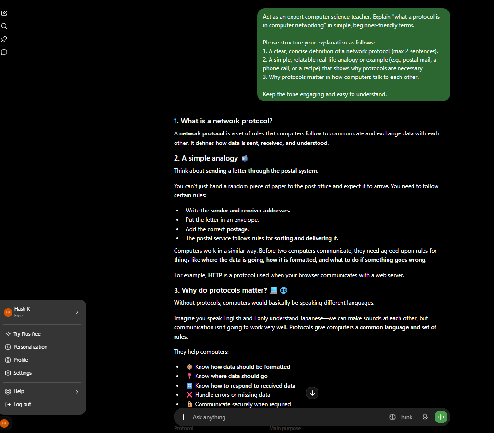
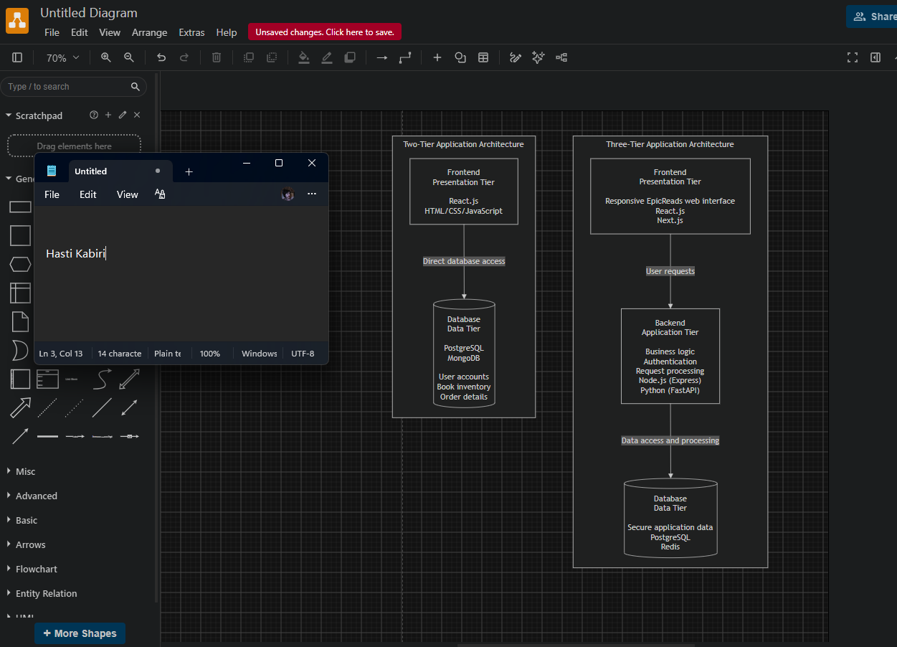
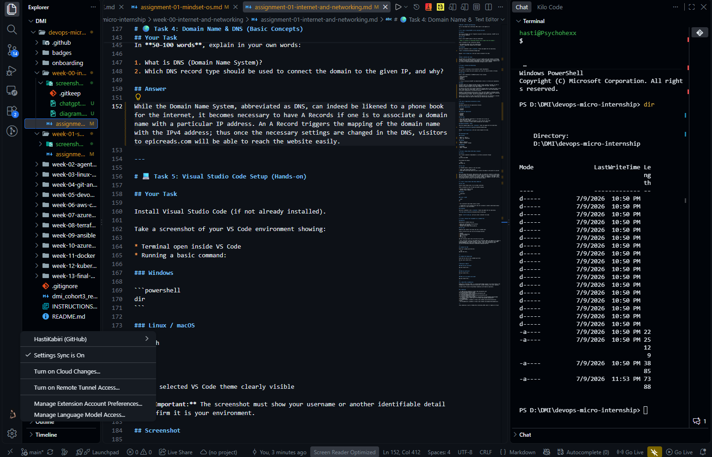

# Week 00 - Internet and Networking

Part of the DevOps Micro Internship (DMI) Cohort 3 with Agentic AI

---

# 🧑‍💻 Task 1: Using ChatGPT as Your Learning Assistant

## Scenario

You're new to DevOps and will frequently encounter technical questions. ChatGPT can be your learning companion.

## Your Task

Write a clear ChatGPT prompt to help you understand:

> "What is a protocol in networking? Explain with a simple real-life example."

Take a screenshot of your interaction showing:

* Your detailed prompt (with clear expectations)
* ChatGPT's simplified response with an example

## Screenshot

Save your screenshot in the `screenshots` folder and update the file name below.




Replace `task-1-chatgpt.png` with your actual screenshot file name.

---

## What I Learned (2–3 lines)

The definition of a Network Protocol is a set of agreed rules with regards to encoding, sending, and receiving information by computers. Using the analogy of the postal system, it further explains how without standardized rules and a common language, computers will not be able to communicate/display meaningful messages across a network.

---

# 🌐 Task 2: Internet and Networking

## Scenario

Your friend is launching an online bookstore named **EpicReads**.

He asked you to explain how users globally can access his website hosted in Finland.

## Your Task

Write a short explanation (**100–150 words**) that includes:

* Packet Switching
* IP Address
* TCP/IP
* HTTP/HTTPS

💡 **Tip:** You may use ChatGPT (as demonstrated in Task 1) to refine your explanation.

## Answer

EpicReads makes your webpage available through a server located in Finland. As soon as visitors click on the website link from anywhere around the globe, they begin a spectacular digital journey in less than a second.

All devices and servers have unique IP Addresses allowing them to locate each other in the world. They connect by using TCP/IP, which is a standard set of rules that guarantees error-proof transmission of information and data.

Instead of transmitting the entire site at once, the server employs a technique called Packet Switching. The website information is divided into packets, which get transmitted via different network routes. They are reassembled on the user's browser.

Requests and responses are made using HTTP/HTTPS meaning that the connection is secured and encryption tools are used for protecting user data during transactions.


---

# 🏗️ Task 3: Application Architecture & Stack

## Scenario

EpicReads bookstore has two application versions:

### Two-Tier Application

* Frontend
* Database

### Three-Tier Application

* Frontend
* Backend
* Database

## Your Task

* Draw simple diagrams (hand-drawn or tool-based such as draw.io)
* Label each layer clearly
* List at least two common technologies or tools used for each layer
* Submit a screenshot or photo clearly showing your own drawing

## Diagram Screenshot / Photo

Save your diagram image in the `screenshots` folder and update the file name below.




Replace `task-3-diagram.png` with your actual diagram file name.

---

## Technologies Used

### Frontend

* React.js / Next.js
* HTML, CSS, JavaScript

### Backend

* Node.js (Express)
* Python (FastAPI / Django)

### Database

* PostgreSQL
* Redis / MongoDB

---

# 🌍 Task 4: Domain Name & DNS (Basic Concepts)

## Scenario

Your friend's bookstore **EpicReads** is currently accessible through:

```text
52.172.142.222:3000
```

He purchased the domain:

```text
epicreads.com
```

## Your Task

In **50–100 words**, explain in your own words:

1. What is DNS (Domain Name System)?
2. Which DNS record type should be used to connect the domain to the given IP, and why?

## Answer

While the Domain Name System, abbreviated as DNS, can indeed be likened to a phone book for the internet, it becomes necessary to have A Records if one is to associate a domain name with a particular IP address. An A Record triggers the mapping of the domain name with the IPv4 address; thus once the necessary settings are changed in the DNS, visitors to epicreads.com will be able to reach the website easily.

---

# 💻 Task 5: Visual Studio Code Setup (Hands-on)

## Your Task

Install Visual Studio Code (if not already installed).

Take a screenshot of your VS Code environment showing:

* Terminal open inside VS Code
* Running a basic command:

### Windows

```powershell
dir
```

### Linux / macOS

```bash
pwd
ls
```

* Your selected VS Code theme clearly visible

⚠️ **Important:** The screenshot must show your username or another identifiable detail to confirm it is your environment.

## Screenshot

Save your screenshot in the `screenshots` folder and update the file name below.




Replace `task-5-vscode.png` with your actual screenshot file name.

---

# 🔗 Task 6: Publish Your Assignment as a LinkedIn Post

## Objective

Publishing on LinkedIn helps you:

* Build your professional online presence
* Reinforce your learning
* Document your DevOps journey publicly

## Your Task

Summarize your answers from Tasks 1–5 into a LinkedIn post.

Clearly structure your post into the following sections:

* ChatGPT
* Internet & Networking
* App Architecture
* DNS
* VS Code Setup

Add the following credit note at the end of your post:

> **P.S. This post is part of the DevOps Micro Internship (DMI) with Agentic AI — Cohort 3 — by Pravin Mishra. My graded progress is public: https://dmi.pravinmishra.com/s/YOUR-GITHUB-USERNAME.html · Start your DevOps journey: https://dmi.pravinmishra.com/?utm_source=student&utm_medium=ps-linkedin&utm_campaign=cohort3**

---

## LinkedIn Post URL

Paste your LinkedIn post URL here:

```
https://lnkd.in/p/ggEAmrKb
```

---

## LinkedIn Post Backup Copy

I’ve been working through assignments for the DevOps Micro Internship (DMI), and honestly, I’ve learned way more than I expected from it.🫡✨

A few things I’ve been exploring along the way:
1- Getting better at using AI — learning how to write more precise prompts and break down complicated technical concepts into simple, understandable explanations.

2- Understanding how the internet actually works — going deeper into IP addresses, TCP/IP, packet switching, and how HTTP/HTTPS handle communication.

3- Software architecture — working with Two-Tier and Three-Tier architectures and understanding how the frontend, backend, and database connect through a sample bookstore project, EpicReads.

4- DNS — finally getting a clearer picture of what happens behind the scenes when we type a domain name into a browser, including how DNS translates it into an IP address using records like A records.

5- My development environment — getting more comfortable with VS Code and Git, and making my workflow a little less chaotic. 

What I like most about this experience is that these aren’t just isolated concepts. They’re helping me understand what’s actually happening behind the code I write — and that’s probably the part I enjoy the most.🩷✨
Still learning, still experimenting, and definitely still have a lot to figure out. 👌🏻


P.S. This post is part of the DevOps Micro Internship (DMI) with Agentic AI — Campus — by [ Pravin Mishra ]
 
My graded progress is public:
https://lnkd.in/gz-s_MBH
 
Start your DevOps journey: https://lnkd.in/gAw5G5HK

---

# Reflection – Week 0

### What did you find easy?

Understanding elementary ideas about networking (including IP addresses) and initiating the work environment (using VS Code and Git) has appeared quite easy and clear with proper instructions.

---

### What was difficult?

Understanding the underlying structural variances between Two-Tier and Three-Tier application architectures and how the back-end logic effortlessly connects the front-end with the database structures required some more concentration.

---

### What will you improve next week?

I want to improve my speed and confidence when navigating terminal commands and managing Git workflows, ensuring I can handle version control and project setups with zero hesitation.

---

## 📌 About DMI & CloudAdvisory

DevOps Micro Internship (DMI) is a project-based DevOps program run by Pravin Mishra (The CloudAdvisory) focused on real-world execution, systems thinking, and career readiness.

It helps learners build strong DevOps foundations with hands-on experience.


## 📌 Resources

- 🌐 **DMI Official Website:** https://dmi.pravinmishra.com?utm_source=github&utm_medium=readme  
- 🎓 **University:** https://university.pravinmishra.com?utm_source=github&utm_medium=readme  
- 💬 **Discord Community:** https://discord.pravinmishra.com?utm_source=github&utm_medium=readme  
- 📝 **Blog:** https://dmi.pravinmishra.com/blog?utm_source=github&utm_medium=readme  
- ▶️ **YouTube Playlist (DMI Cohort 3):** https://www.youtube.com/playlist?list=PLFeSNDtI4Cho  
- 🔗 **Pravin Mishra (LinkedIn):** https://www.linkedin.com/in/pravin-mishra-aws-trainer/  
- 🏢 **CloudAdvisory (LinkedIn):** https://www.linkedin.com/company/thecloudadvisory/

---

*This submission is part of DevOps Micro Internship (DMI) Cohort 3 — Agentic AI Track*