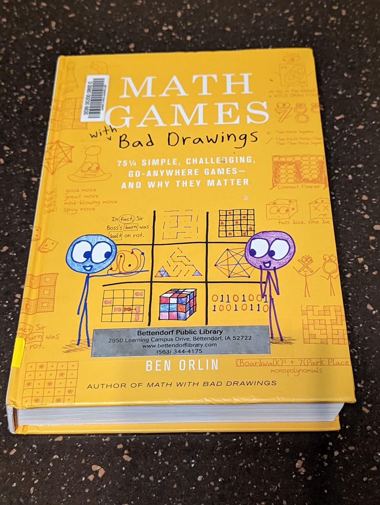
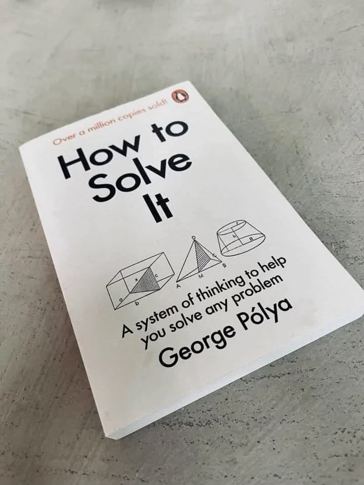
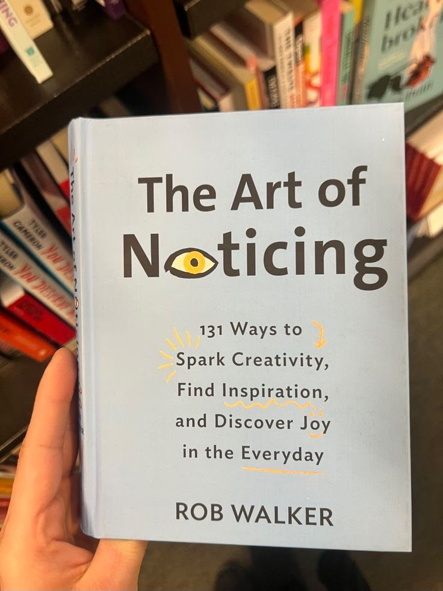

# Week 01 — Success Mindset (Mindset OS)

Part of the DevOps Micro Internship (DMI) Cohort 3 with Agentic AI

---

## Purpose (Read This First)

This week is not motivation homework.

This is you building your **Mindset OS** — the system you will use for the next 5 months (and honestly, for years).

### Expectations

* Be honest.
* Be specific.
* Be practical.
* Write like an adult professional: clear sentences, no one-liners.

You will reuse this in later weeks. So do it properly once.

---

# Assignment 1. What is something you believe to be true that most people around you would disagree with?

### Rules

* No "safe" answers.
* Must be your real belief (not copied from internet).
* Minimum 50 words.

**Hint:** What do you believe about career, money, learning, discipline, relationships, health, success, life, tech industry, etc. that most people don't agree with?

## Answer

I believe being delusional at some point will help you to grow and reach places that no one could ever imagine. Just believe in your capabilities of reaching the best

---

# Assignment 2. What are the top 3 objective truths you discovered through experimentation and results?

### Definition

Objective truths do not depend on opinions. They hold true regardless of how people feel.

Write each truth in this format:

**Truth:** (1 sentence)

**Evidence from my life:** (2–4 lines: what you tried + what happened)

---

## Truth #1

### Truth

Poor task division among team members inevitably leads to chaos and overlapping code.

### Evidence from my life

While carrying out the coding activity in a group, there was no clear specification of who was responsible for which component. Consequently, multiple individuals made changes to the same file concurrently, resulting in significant merge conflicts and subsequently wasting numerous hours rectifying the overlapping code.
---

## Truth #2

### Truth

Omitting Use Cases in real-world software development causes code misalignment and confusion among developers.

### Evidence from my life

During the development of software, the absence of a specification or architecture namely led to mixing of business logic with the presentation layer, so that the code became unclear for other programmers, who did not know where specific features had been implemented.
---

## Truth #3

### Truth

Hardcoding configuration values instead of using environment variables compromises security and scalability.

### Evidence from my life

During the local application test, critical API keys were unintentionally hardcoded and kept in the application's source code. When it was time to deploy the application, many extra hours were spent on rewriting and securing the API keys, which leads to the conclusion that doing it properly from the very beginning is critical.

---

# Assignment 3. What does your 2.0 version look like?

### Instructions

Write as if a journalist is writing about you **3 to 7 years from now** (not 20 years).

**Minimum 300 words.**

### Rules

* Write in past tense, like it already happened.
* Don't use "likes to / wants to / hopes to."
* Use specifics:

  * built
  * shipped
  * led
  * published
  * earned
  * relocated
  * contributed
* Include skills proof:

  * projects
  * portfolios
  * GitHub
  * blogs
  * certifications
  * job role
  * leadership
  * community contribution
* Add 1–3 images if you can (optional but powerful).

### Publish It Publicly On Any ONE

* LinkedIn
* Medium
* WordPress
* Blogspot
* Personal blog
* Portfolio page

Include this line:

> **P.S. This post is part of the DevOps Micro Internship (DMI) with Agentic AI — Cohort 3 — by [Pravin Mishra](https://www.linkedin.com/in/pravin-mishra-aws-trainer/). My graded progress is public: https://dmi.pravinmishra.com/s/YOUR-GITHUB-USERNAME.html · Start your DevOps journey: https://dmi.pravinmishra.com/?utm_source=student&utm_medium=ps-blog&utm_campaign=cohort3**

## Your Article

The local magician has become a global sensation: here is the story of Hasti.
Date: [2027–2031]
By: [Sherlock Holmes], TechBeat International

It is hard to believe how far Hasti Kabiri has come in just five years. From a quiet place in the tech world, she was driven less by ambition than the desire to figure out how things work. She dedicated a lot of time to coding and developed her own motto: “My curiosity leads me.”

Learning was one thing; living through development was another one. It didn’t take Hasti long to grow from an amateur to an independent developer, mastering the full-stack engineering and DevOps pipeline techniques. She faced challenges on the way but didn’t give up and converted problems into the evidence of her skills.

The critical moment for her occurred when she reconciled her technical expertise with her strong commitment to making some change. She created and launched several "cool and useful projects" – applications that did not merely exist but also helped to address real-life issues. 

Her portfolio, publicly available on the GitHub platform and presented in her technical blog, contains intuitive platforms helping disadvantaged communities, providing access to necessary services, and addressing major information gaps.
 
It is important to emphasize that this is not merely code but compassion embodied in technology. 

Through her willingness to grow, she overcame international borders. Her professional journey has taken her to various tech centers, including London and Tokyo, giving her not only work challenges, but also enriching experience of different cultures.

Today’s Hasti proves how powerful self-belief can be when combined with learning continuously and helping those around us. Hasti has developed a strong technical background allowing her to work confidently in the world’s most technology-driven spaces. However, she never forgets her beginnings as a girl full of curiosity. She can measure her success by her job title and projects, but what makes it true is the impact she has on other people in need. Hasti is an example of how one can believe in oneself while also helping others.

 P.S. This post is part of the DevOps Micro Internship (DMI) with Agentic AI — Campus — by [Pravin Mishra](https://www.linkedin.com/in/pravin-mishra-aws-trainer/). My graded progress is public: 
 https://github.com/HastiKabiri/devops-micro-internship.git  · Start your DevOps journey: https://dmi.pravinmishra.com/?utm_source=student&utm_medium=ps-blog&utm_campaign=cohort3**

### Public Link

Paste your link here:

` https://medium.com/@hastikabiri9339/the-local-magician-has-become-a-global-sensation-here-is-the-story-of-hasti-8aa9e32b9a26?sharedUserId=hastikabiri9339 `

---

# Assignment 4. Have you ever cut corners (unethical / dishonest / shortcut behavior — not necessarily illegal)? If yes, how did it make you feel?

### Important

You don't need to write the full story.

Focus on the feeling:

* guilt
* fear
* shame
* stress
* regret
* numbness
* etc.

This is about self-awareness, not judgment.

### Answer Format

**Yes / No**

If Yes:

**What emotion did you feel?** (minimum 50–100 words)

## Answer

No 
Although I was in high school, I refrained from unethical means such as cheating. I didn't need to follow rules to know that the work of others is not always reliable. Most importantly, however, I was always eager to find out how capable I really was and how to achieve this in an honest way. Doing everything myself made me happy, even if it meant sometimes struggling.

---

# Assignment 5. What are 10 non-fiction books you plan to read in the next 1 year?

### Rules

* Mention **Title + Author**
* Any language allowed
* No fiction novels

### Tip

Choose books that improve:

* mindset
* communication
* productivity
* health
* money
* career
* leadership

## Book List

1. Math Games with bad drawings - Ben Orlin

2. How to solve it - George polya

3. The science behind procrastination (How your brain tricks you) - Cole Paxton

4. The psychology of money - Morgan Housel

5. The subtle art of not giving a fuck - Mark Manson

6. Smart choices, a practical guide to making better decisions - John s.Hammond

7. How to talk to anyone - Leil Lowndes

8. How to deal with idiots (and stop being one yourself) - Maxime Rovere

9.  The art of noticing - Rob Walker

10. How to build a healthy brain - Kimberley Wilson

---

# Assignment 6. What are the things you will measure regularly in your life and career?

### Rules

List topics only. No need to share numbers.

### Must Include

* Learning / skill
* Output / proof
* Health / energy
* Time / focus
* Money / finance (personal or business)

### Example

* Learning hours per week
* Deep work sessions per week
* Projects shipped / documented
* Steps / workouts
* Sleep hours
* Spending tracker

## My Metrics

* daily physical energy and workout consistency
* Personal finance and expense tracking
* code quality
* weekly networking and community engagement
* mental well being and offline relaxation time

---

# Assignment 7. Brain Dump + 5-Month System Plan

## Step 1: Brain Dump (Private)

Do a brain dump of everything in your mind into a notebook.

Examples:

* Bills
* Tasks
* Worries
* Goals
* Pending messages
* Ideas
* Responsibilities

### Did You Do It?

**Yes**

Answer:

im worried about my results from my University. my goal is to become stronger in tech field and make a good background of myself. i am doing physical internship for the next 5 month, and im trying to handle everything and stay calm under pressure.

---

## Step 2: Your 5-Month Routine + Focus Blocks

Create a simple plan you can realistically follow for the next 5 months.

### Weekly Routine

Example:

* Mon–Thu: 60 min deep work
* Sat: DMI session
* Sun: Weekly review

#### My Weekly Routine

Mon-thu : 60 min of reading a book
sat: DMI session
Sun: rest well

---

### Focus Blocks

#### When Will You Do DMI Work? (Days + Time)

6 days- after my internship working hours (between 7 pm to 11 pm)

#### How Many Sessions Per Week?

1 session

---

### Distraction Rules

Examples:

* Phone rules
* Social media rules
* Environment setup

#### My Distraction Rules

less focus on social media

---

# Reflection – Week 1

### Biggest insight I got about myself this week

i have to grow patiently not quickly

### My biggest weakness/loop I noticed

Sometimes i try to make something too perfect

### One system I will implement from this week (exact habit + time)

learn a new language - 1 hour per day after my internship hours

### LinkedIn Post

Paste your LinkedIn post link here:

`Add your URL here`

---

## 10. Proof of Work
  
- Blog / Medium : **[ADD LINK HERE](https://medium.com/@hastikabiri9339/reflection-week-1-3143f31242f0?sharedUserId=hastikabiri9339)**  

---

## 📌 About DMI & CloudAdvisory

DevOps Micro Internship (DMI) is a project-based DevOps program run by Pravin Mishra (The CloudAdvisory) focused on real-world execution, systems thinking, and career readiness.

It helps learners build strong DevOps foundations with hands-on experience.

## 📌 Resources

- 🌐 **DMI Official Website:** https://dmi.pravinmishra.com?utm_source=github&utm_medium=readme  
- 🎓 **University:** https://university.pravinmishra.com?utm_source=github&utm_medium=readme  
- 💬 **Discord Community:** https://discord.pravinmishra.com?utm_source=github&utm_medium=readme  
- 📝 **Blog:** https://dmi.pravinmishra.com/blog?utm_source=github&utm_medium=readme  
- ▶️ **YouTube Playlist (DMI Cohort 3):** https://www.youtube.com/playlist?list=PLFeSNDtI4Cho  
- 🔗 **Pravin Mishra (LinkedIn):** https://www.linkedin.com/in/pravin-mishra-aws-trainer/  
- 🏢 **CloudAdvisory (LinkedIn):** https://www.linkedin.com/company/thecloudadvisory/

---

*This submission is part of DevOps Micro Internship (DMI) Cohort 3 — Agentic AI Track*